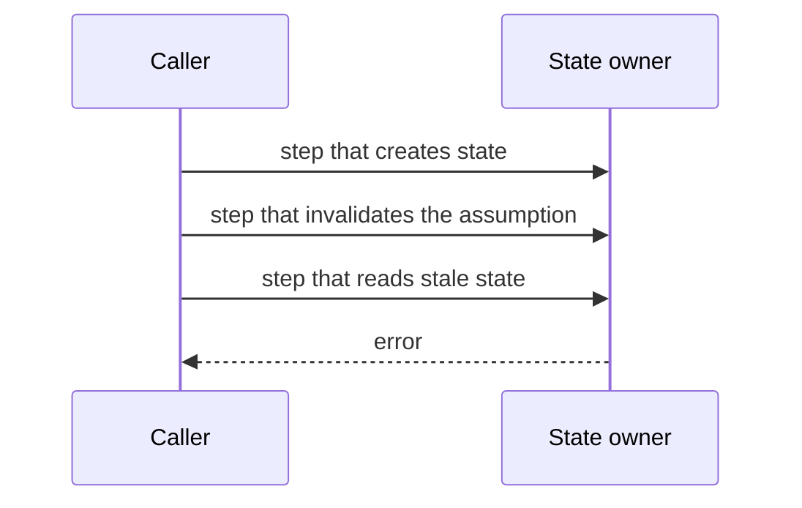

# Issue Body Template

Use this template as a decision guide. Keep `Problem`, `Environment`, and `Reproduction`. Add other sections only when they help triage. Do not invent content to fill a section.

## Title

Name the component, the trigger, and the symptom. Include the exact error code when one exists.

```text
<component>: <symptom> when <trigger> (`<error_code>`)
```

## Problem

State the failure in one sentence. Then give the details.

**Observed:** `<what happens, with the exact error message>`

**Expected:** `<what should happen>`

**Impact:** `<who is affected, how often, data or security effect, and whether a workaround exists>`

```text
<exact error output or log line>
```

## Environment

| Item | Value |
| --- | --- |
| Version | `<version, tag, or commit>` |
| Install method | `<package manager, binary, container, source>` |
| OS / arch | `<os and architecture>` |
| Relevant config | `<only settings that affect the failure>` |

Add the runtime, agent, browser, or dependency versions only when they matter.

## Reproduction

State the reproduction rate first: `Reproduced N/N runs in an isolated environment`, `Intermittent (about N/M)`, or `Not reproduced in isolation`.

### Preconditions

- `<required state, account, configuration, or data>`

### Steps

1. `<smallest first action>`
2. `<next action>`
3. `<action that triggers the failure>`

When timing matters, explain the window and how the steps hit it. Attach or inline a script when manual timing is unreliable:

```bash
<minimal reproduction script or commands>
```

### Evidence

Show the trimmed, ordered output that proves the failure. Keep the timestamps.

```text
<timestamp> <relevant log line: setup step>
<timestamp> <relevant log line: state transition>
<timestamp> <relevant log line: error>
```

When the issue comes from a real incident, map the reproduction to it:

| Step | Incident | Reproduction |
| --- | --- | --- |
| `<step>` | `<timestamp and signature>` | `<timestamp and signature>` |

## Root cause analysis

Use this section when code or logs confirm the mechanism. Label each unconfirmed claim as `Suspected`.

Describe the chain from the trigger to the failure as numbered steps. Name the state owner and the missing guard or cleanup.

Use a sequence or state diagram when ordering or a lifecycle explains the fault faster than prose:



## Related code

Include this section only for an open-source project. Use permalinks at a tag or commit SHA.

| Location | Role in the failure |
| --- | --- |
| [`<symbol>`](<permalink#Lstart-Lend>) | `<creates, owns, reads, or fails to clean up the state>` |

If you inspected a bundled or installed build instead of source, state the version and use symbol names instead of permalinks.

## Suggested fix

Include this section only for an open-source project, and only when the analysis supports it. Present it as a suggestion.

1. `<recommended direction and the invariant it restores>`
2. `<alternative and its trade-off>`

**Must preserve:** `<safety logic, side effects, or contracts that the fix must keep>`

**Regression test:** `<test that encodes the reproduction>`

## Workaround

Include this section only when a workaround is verified.

- `<workaround and its cost>`

List the attempted workarounds that did not work when that prevents wasted effort.

## Additional context

Add related issues, upstream dependencies, or open questions. Mark each unverified item as `Not verified`.
